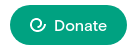

# Every.org Donate Button

For nonprofits — the simplest way to give your supporters a beautiful donation experience. This button opens a donation flow through [Every.org](https://www.every.org/nonprofits).

See some demoes at https://embeds.every.org/0.4. And see this in production helping raise funds at https://www.goodjobbub.org/

## Use

Here is an example html file with a donate button for https://www.every.org/lilbubsbigfund. You can copy
paste this code and and then replace lilbubsbigfund with the correct handle.

If you want us to style the button for you, add `data-edo-button` and it will use Every.org styling.

```html
<!DOCTYPE html>
<html lang="en">
  <body>
    <a href="https://www.every.org/lilbubsbigfund#/donate">Donate</a>
    <script async defer src="https://embeds.every.org/0.4/button.js"></script>
  </body>
</html>
```

## Configure

To configure your button manualy, add `?explicit=1` to the script `src`

Here is an example html file with a manual configuration.

```html
<!DOCTYPE html>
<html lang="en">
  <body>
    <div id="edo-donate-btn">
      <a href="https://www.every.org/lilbubsbigfund#/donate">Donate</a>
    </div>
    <script
      async
      defer
      src="https://embeds.every.org/0.4/button.js?explicit=1"
      id="edo-donate-btn-js"
    ></script>
    <script>
      function createWidget() {
        everyDotOrgDonateButton.createButton({
          selector: "#edo-donate-btn",
        });
        everyDotOrgDonateButton.createWidget({
          selector: "#edo-donate-btn",
          nonprofitSlug: "lilbubsbigfund",
        });
      }
      if (window.everyDotOrgDonateButton) {
        createWidget();
      } else {
        document.getElementById("edo-donate-btn-js").onload = createWidget;
      }
    </script>
  </body>
</html>
```

### Widget

#### Configuration options

The `createWidget` function accepts an object with the following properties:

```ts
  {
    /**
     * Selector to render button in
     */
    selector?: string;
    /**
     * Identifier for nonprofit on Every.org; you can get it by going to the
     * nonprofit's profile on Every.org and looking at its URL
     * @example
     * If the URL is https://www.every.org/givedirectly, the slug is "givedirectly"
     */
    nonprofitSlug: string;
    /**
     * Identifier for fundraiser on Every.org; you can get it by going to the
     * fundraiser's profile on Every.org and looking at its URL
     * @example
     * If the URL is https://www.every.org/givedirectly/f/my-fundraiser, the slug is "my-fundraiser"
     */
    fundraiserSlug?: string;
    /**
     * Payment methods: ["card", "bank", "paypal", "venmo", "pay", "crypto", "stocks", "daf"]
     * "pay" - for apple/google pay
     */
    methods?: string[];
    /**
     * An anchor which, if present in the URL, opens the widget
     * @default "donate"
     */
    openAt?: string;
    /**
     * If true shows the widget
     * @default false
     */
    show?: boolean;
    /**
     * Accent color for widget ui
     * @default "#018669"
     */
    primaryColor?: string;

    defaultDonationAmount?: number;
    /**
     * Minimum donation amount
     * @default 5
     */
    minDonationAmount?: number;
    /**
     * Donation frequency
     * @default 'once'
     */
    defaultFrequency?: DonationFrequency;
    /**
     * Amount suggestions
     * @default [10, 50, 100]
     */
    addAmounts?: number[];
    /**
     * @default false
     */
    completeDonationInNewTab?: boolean;
    /**
     * If present, do not show the normal www.every.org background,
     * only show the donation modal and do not allow people to exit
     * the modal.
     * @default true
     */
    noExit?: boolean;
  }
```

Also you can change them in runtime. Example:

```js
  <script>
    // Ensure that the script was fully loaded before do this
    everyDotOrgDonateButton.setOptions({
        ...
    })
    everyDotOrgDonateButton.show()
  </script>
```

### Button

If you don't want to create a button in your site, style it and link to the widget you can use our styled button that it's fully customizable.
We are linking the button to the widget automatically!



#### Minimum configuration

```js
  <script>
    everyDotOrgDonateButton.createButton({
      selector: '#yourElementToAttachTheButton',
      nonprofitSlug: "yourNonprofitSlug"
    })
  </script>
```

#### Customize the button

The `createButton` function accepts an object with the following properties:

```ts
  {
    /**
     * Selector to render button in
     */
    selector?: string;
    /**
     * Identifier for nonprofit on Every.org; you can get it by going to the
     * nonprofit's profile on Every.org and looking at its URL
     * @example
     * If the URL is https://www.every.org/givedirectly, the slug is "givedirectly"
     */
    nonprofitSlug: string;
    /**
     * Identifier for fundraiser on Every.org; you can get it by going to the
     * fundraiser's profile on Every.org and looking at its URL
     * @example
     * If the URL is https://www.every.org/givedirectly/f/my-fundraiser, the slug is "my-fundraiser"
     */
    fundraiserSlug?: string;
    /**
     * If present, do not show the normal www.every.org background,
     * only show the donation modal and do not allow people to exit
     * the modal.
     * @default true
     */
    noExit?: boolean;
    /**
     * If not present, just a link to hrefUrl
     */
    onClick?: () => void;
    /**
     * Button text
     * @default "Donate"
     */
    label?: string;
    // Css class to add to the button
    className?: string;
    // Show the every icon inside the button
    withIcon: boolean;
    // Useful styling props
    bgColor?: string;
    textColor?: string;
    borderRadius?: string;
    fontSize?: string;
    padding?: string;
  }
```

## API

We expose three functions through the global `everyDotOrgDonateButton` object:

- `createButton({selector, ...buttonOptions})`: Function to generate a styled and customizable button inside the selector.

- `createWidget({selector, ...widgetOptions})`: Function to link a selector with the widget. As optional you can pass extra options that would be set only when the user open the widget with that button.

- `setOptions(options)`: Function to set/override the configuration of the widget.

- `showWidget()`: Open the widget with javascript code.

## Demo site hosting details

- Vercel hosts `embeds.every.org` as a static site from
  `docs/dist/donate-button/` - the root URL is the `index.html` page in that
  folder (which was written by hand, not generated)
- Github Pages hosts `assets.every.org` as a static site from the `docs/`
  folder; Github Pages hosts our embeddable JS bundle from there.
